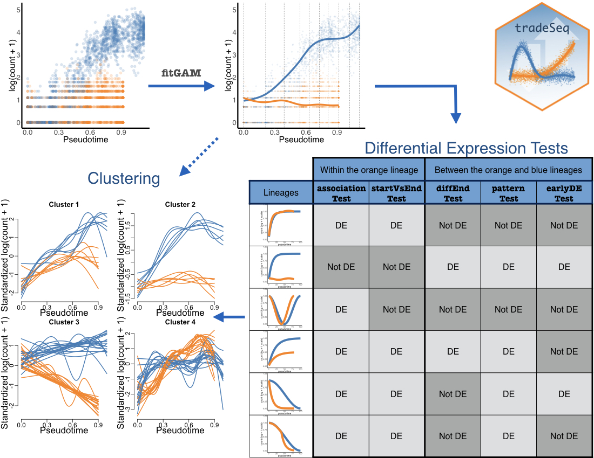

# R package: tradeSeq

  <!-- badges: start -->
  [](https://travis-ci.com/statOmics/tradeSeq)
  [](https://github.com/statOmics/tradeSeq/actions)  
  [](https://codecov.io/gh/statOmics/tradeSeq?branch=master)
  <!-- badges: end -->

## TRAjectory Differential Expression analysis for SEQuencing data

tradeSeq provides a flexible method for discovering genes that are differentially expressed along one or multiple lineages, using a variety of tests suited to answer many questions of interest.

## Installation

To install the current version of *tradeSeq* in Bioconductor, run.

```
if(!requireNamespace("BiocManager", quietly = TRUE)) {
 install.packages("BiocManager") 
}
BiocManager::install("tradeSeq")
```

To install the development version in `R`, run 

```r
devtools::install_github("statOmics/tradeSeq")
```

The installation should only take a few seconds.
The dependencies of the package are listed in the DESCRIPTION file of the package.

## Issues and bug reports

Please use https://github.com/statOmics/tradeSeq/issues to submit issues, bug reports, and comments.

## Usage 

Start with the vignette [online](https://statomics.github.io/tradeSeq/articles/tradeSeq.html).

## Cheatsheet

You can also refer to this cheatsheet to undersand a common workflow



## Contributing and requesting

A number of tests have been implemented in tradeSeq, but researchers may be interested in other hypotheses that current implementations may not be able to address. We therefore welcome contributions on GitHub on novel tests based on the tradeSeq model.
Similar, you may also request novel tests to be implemented in tradeSeq by the developers, preferably by adding an issue on the GitHub repository. If we feel that the suggested test is widely applicable, we will implement it in tradeSeq.
